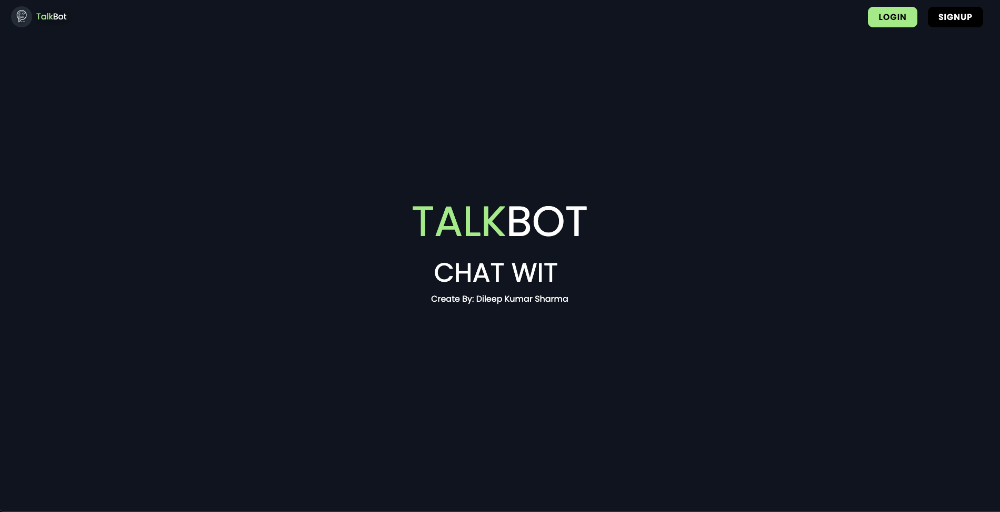
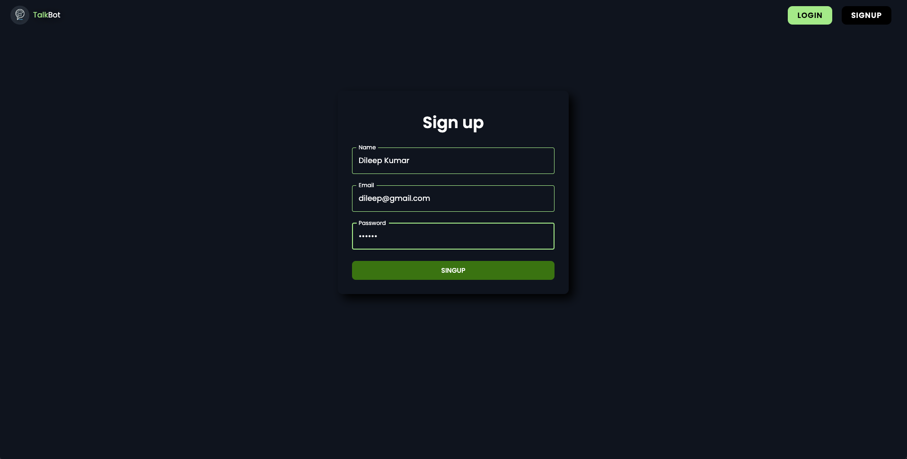
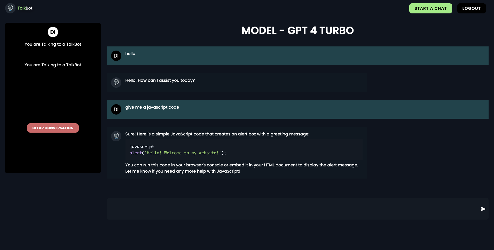

# TalkBot - Full Stack Project

## Overview

This project is a full-stack application that simulates an OpenAI chatbot. The application integrates OpenAI APIs to provide AI-driven conversational capabilities and is built using a modern web development stack. The project features both a frontend and a backend, creating a seamless and robust user experience.

## Features

- **AI-Powered Chatbot:** Utilizes the OpenAI API to generate intelligent responses to user queries.
- **User Authentication:** Secure login and registration system using JSON Web Tokens (JWT).
- **Real-Time Chat:** Dynamic chat interface that updates in real-time.
- **Responsive Design:** The UI is mobile-friendly and responsive, ensuring usability across different devices.
- **Persistent Chat History:** Chat conversations are stored in a database for future reference.
- **Scalable Architecture:** Built to be easily scalable and maintainable.

## Technical Skills and Tools

### Frontend

- **React.js:** JavaScript library for building dynamic and interactive user interfaces.
- **Material-UI:** React components for faster and easier web development with a consistent design.
- **React Router:** For handling routing within the application.
- **Axios:** Promise-based HTTP client for the browser and Node.js, used for making API requests.

### Backend

- **Node.js:** JavaScript runtime built on Chrome's V8 JavaScript engine, used to build the backend server.
- **Express.js:** Minimalist web framework for Node.js, used to create the RESTful API.
- **MongoDB:** NoSQL database for storing user data and chat histories.
- **Mongoose:** Elegant MongoDB object modeling for Node.js.
- **JWT (JSON Web Tokens):** Standard method for securely transmitting information between parties as a JSON object.
- **OpenAI API:** API provided by OpenAI for accessing advanced AI models.

### Development and Deployment

- **Git:** Version control system for tracking changes in the project.
- **Docker (Optional):** Containerization platform for packaging applications with their dependencies, ensuring consistency across environments.
- **Postman:** API client used for testing and documenting the API endpoints.
- **ESLint & Prettier:** Tools for maintaining code quality and consistency.

## Project Structure

- **/frontend:** Contains the React.js code, including components, pages, and assets.
- **/backend:** Contains the Express.js server code, API routes, and MongoDB models.

## Setup Instructions

### Prerequisites

- **Node.js** (v14 or higher)
- **MongoDB** (local or cloud instance)
- **Docker** (optional, for containerization)

### API Endpoints

- **POST /api/auth/register:** Register a new user.
- **POST /api/auth/login:** Log in an existing user.
- **GET /api/chat/history:** Retrieve chat history for a logged-in user.
- **POST /api/chat/send:** Send a message to the chatbot and receive a response.

## Project Screenshots

### Chatbot Interface

